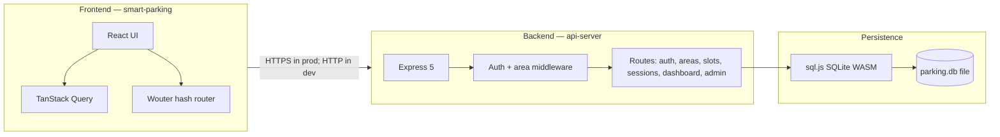

# Smart Parking System — Project Overview

**Purpose:** This document is a self-contained overview for academic presentation: what the application does, how it is built, which technologies are used, current strengths and limits, security and development caveats, and realistic directions for scaling.

---

## 1. Executive summary

This project is a **full-stack smart parking prototype**: drivers and administrators interact through a **React web client** that talks to a **Node.js REST API**. The backend stores data in **SQLite via sql.js** (file-backed), supports **multiple parking sites** (mall, metro, office), **JWT-based login**, **slot booking**, **rule-based slot recommendations**, **session lifecycle** (book → park → pay → complete), **admin dashboards**, and **user / vehicle management**. Payments and gate hardware are **simulated** for demonstration, not production integrations.

---

## 2. Problem statement (college framing)

Urban parking suffers from poor visibility of availability, slow manual allocation, and weak guidance once a vehicle enters a structure. This system models **digital booking**, **preference-aware recommendations**, **operational metrics per site**, and **clear separation between driver and admin workflows**—as a foundation that could later connect to sensors, payments, and physical barriers.

---

## 3. High-level architecture



**Request flow (typical):**

1. User logs in → API validates credentials → returns **JWT access token** (8h lifetime).
2. Client sends `Authorization: Bearer <token>` on subsequent calls.
3. Area-scoped routes live under `/api/areas/:areaId/...` where `:areaId` can be a stable id or a **slug** (e.g. `city-mall`).
4. Middleware resolves the parking area; handlers read/write SQLite and persist the database file after mutations.

---

## 4. Technology stack

### 4.1 Frontend (`smart-parking/`)

| Layer | Technology |
|--------|----------------|
| Runtime / UI | **React 18**, **TypeScript** |
| Build | **Vite 7** |
| Routing | **Wouter** with **hash-based** locations (`#/book`, etc.) — friendly for static hosting |
| Server state | **TanStack React Query** |
| Forms / validation | **React Hook Form**, **Zod** |
| Styling | **Tailwind CSS 4**, **Radix UI** primitives, **class-variance-authority**, **tailwind-merge** |
| Charts / motion | **Recharts**, **Framer Motion** |
| Misc | **date-fns**, **Lucide** icons, **Sonner** toasts, **QRCode.react** for display QR payloads |

### 4.2 Backend (`api-server/`)

| Layer | Technology |
|--------|----------------|
| Runtime | **Node.js** (ES modules), **TypeScript** |
| HTTP | **Express 5** |
| Validation | **Zod** |
| Auth | **jose** (JWT, HS256), **Bearer** tokens in `Authorization` header |
| Passwords | **PBKDF2** (SHA-256, 120k iterations, per-user salt), **timing-safe** compare |
| Database | **sql.js** — SQLite compiled to WASM, **in-process**; optional `DATABASE_PATH` env |
| Logging | **pino**, **pino-http** |
| CORS | **cors** package; origins from `CORS_ORIGIN` (comma-separated or `*`) |
| Build | **esbuild** (bundled `dist/index.mjs`), custom **build.mjs** |
| Tests | **Vitest** (e.g. recommendation logic unit tests) |

### 4.3 Data model (conceptual)

- **users** — username, password hash, role (`admin` \| `user`).
- **parking_areas** — multi-site metadata (id, slug, name, kind: mall / metro / office).
- **parking_slots** — per-area slots (level, type: standard / ev / accessible / premium, paid/free, price, near lift, availability).
- **parking_sessions** — bookings and lifecycle fields (times, fees, payment status, route text, QR payload string).
- **user_cars** — vehicles registered to a user (normalized plate for lookups).

Seeded demo areas include **City Mall**, **Central Metro Park & Ride**, and **Tech Campus Garage**, each with generated slot grids from shared patterns in code.

---

## 5. Feature list

### 5.1 End user (driver)

- **Login** with role returned from API.
- **Parking area switcher** in the shell — same account, different sites.
- **Home** — role-aware landing (personal vs property-oriented copy).
- **Book slot** — book with car validation against **My cars**; recommendations optional via filters.
- **My cars** — add/remove registered plates (API-enforced ownership for booking).
- **Level map** — browse slots by level for the selected area.
- **Find my car** — lookup by plate for active session (admin UI variant differs).
- **History** — past and current bookings (cross-area where API supports user-wide history).
- **Payments** — list sessions, live fee polling for parked sessions, **mark paid / complete** flows as implemented in API (no real PSP).

### 5.2 Administrator

- Same navigation with **admin labels** (e.g. property overview, all bookings).
- **Per-area dashboard** — occupancy, EV / accessible counts, active sessions, **revenue today** (from completed session fees in DB), average duration, **level breakdown** (admin-only route).
- **Create users** — provision accounts with optional initial car list; list users with car counts.
- **Session visibility** — broader filters (e.g. filter by `userId` on sessions where implemented).

### 5.3 System / “smart” behaviour

- **Recommendation engine** (`recommend-slots.ts`): filters by EV / accessible / near-lift, free vs paid vs “best” ordering, optional preferred level; capped top **N** results; covered by **unit tests**.
- **Route guidance** — textual **route_steps** generated per area **kind** (mall vs metro vs office).
- **Fee calculation** — hourly ceil from **parking start** and slot **pricePerHour** (demo rules).
- **QR payload** — JSON string bundling session id, plate, slot, fee, timestamp (for UI QR generation, not a signed ticket format).

---

## 6. How the application is built (implementation notes)

- **Monorepo-style layout:** `api-server/` and `smart-parking/` are separate packages with their own `package.json`; they are deployed or run independently.
- **API surface:** All REST endpoints are mounted under **`/api`** (see `app.ts` + `routes/index.ts`).
- **Area scoping:** Shared router `routes/area-scope.ts` mounts slots, recommendation, sessions, and dashboard under **`/api/areas/:areaId/...`** after `attachParkingArea` resolves the area.
- **Auth middleware:** `requireAuth` verifies JWT; `requireRole` / `requireAdmin` enforce RBAC.
- **Frontend API client:** Central `apiRequest` in `api-client.ts` attaches JSON and Bearer token; base URL from **`VITE_API_BASE_URL`** (dev fallback to `http://localhost:8080`).
- **Auth persistence:** Token and user profile stored in **`localStorage`** under a fixed key — simple for coursework, weaker against XSS than httpOnly cookies.
- **Bootstrap:** Server calls database init on startup (`index.ts` → `bootstrapDatabase`), loads or creates SQLite file, runs migrations/seeds, syncs slot rows from seed definitions.

---

## 7. Limitations and cons (honest assessment)

| Topic | Limitation |
|--------|---------------|
| **Scale** | Single Node process + **in-memory sql.js** per instance; **no horizontal replication** of DB; file locking is not a multi-server story. |
| **Concurrency** | No transactional “optimistic locking” narrative for two users booking the same slot at the same millisecond beyond SQLite behaviour; race conditions are possible under heavy parallel load. |
| **Payments** | No **payment gateway** (Razorpay, Stripe, UPI deep link); status changes are **application-level**, not bank-verified. |
| **Hardware** | No **ANPR cameras**, **barriers**, or **IoT**; “Find my car” and entry are **logical** only. |
| **Real-time** | No WebSockets; occupancy and fees rely on **polling** or manual refresh patterns in the UI. |
| **Identity** | Username/password only; no **OAuth**, **MFA**, or enterprise SSO. |
| **Email / SMS** | No notifications for booking confirmation or expiry. |
| **Internationalization** | UI and copy are primarily English; currency shown as **INR** in places as a demo convention. |
| **Static hosting + hash routes** | Good for GitHub Pages-style deploys; URLs are less “clean” than path-based SPA hosting without server fallback configuration. |

---

## 8. Security measures (what exists today)

- **Password hashing:** PBKDF2 with high iteration count and unique salt; verification uses **constant-time** comparison where applicable.
- **JWT:** Signed access tokens; role embedded and validated; **expiry** enforced (8 hours in code).
- **Input validation:** Zod schemas on login, admin user creation, booking, query params, etc.
- **Authorization:** Admin-only routes (dashboard, user admin) separated from user routes; users cannot read arbitrary others’ sessions except where admin tools allow.
- **Car ownership:** Booking paths check that the car belongs to the authenticated user (via `user_cars`).
- **HTTP logging:** Request logging trims sensitive surface (configured serializers on method/url/status); still operate under principle of least log in production.

---

## 9. Security and privacy risks (presentation “red flags”)

> Use this subsection in slides labeled **Risks**, **Threat model**, or **Not production-ready**.

| Risk | Why it matters | Mitigation direction |
|------|----------------|----------------------|
| **Default `JWT_SECRET`** | If `JWT_SECRET` is unset, code falls back to a **known dev string** — anyone who can reach the API could forge tokens. | **Require** a strong secret from env in production; fail fast if missing. |
| **JWT in `localStorage`** | Any **XSS** in the SPA can exfiltrate tokens. | Prefer **httpOnly + Secure + SameSite** cookies with CSRF strategy, or hardened CSP + short-lived tokens + refresh rotation. |
| **CORS `*`** | Default env allows **any origin** if misconfigured — increases CSRF-like abuse surface for cookie-less APIs less, but still poor hygiene with credentials. | Explicit allowlist of front-end origins. |
| **Demo seed passwords** | Seeded accounts (e.g. admin/driver) ship with **known passwords** for grading demos. | Remove or randomize seeds in production; force password reset on first login. |
| **No rate limiting** | Login and write endpoints can be **brute-forced** or DoS’d at small scale. | Add rate limits, CAPTCHA on auth, IP throttling, reverse-proxy rules. |
| **QR payload not signed** | QR content is **plain JSON** — forgeable if an attacker crafts a payload. | Sign payloads (HMAC/JWS), short TTL, server-side redemption only. |
| **SQLite file on disk** | File permissions and backup exposure = data breach risk; single-file DB is easy to copy. | Encrypt at rest, OS-level ACLs, move to managed RDBMS with auditing. |
| **No TLS in local dev** | Acceptable for localhost; **unacceptable** on public networks. | Terminate TLS at reverse proxy (nginx, Caddy, cloud LB). |
| **Trust boundary** | `userId` in DB is the **username string** — simple but couples identity to display name. | Numeric user IDs, separate display names, audit logs. |

---

## 10. Development and maintenance issues (technical debt)

- **`cookie-parser`** appears in backend dependencies but is **not wired** in `app.ts` — either integrate it or remove unused dependency to reduce noise and audit surface.
- **Windows vs Unix scripts:** `api-server` `dev` script uses `NODE_ENV=development` Unix style; on Windows, developers may need **cross-env** or equivalent unless using WSL.
- **Build always runs before `start`:** `npm run start` triggers a full esbuild pass — fine for coursework, slow for tight iteration unless using **`start:fast`** against an existing `dist/`.
- **Single test focus:** Vitest coverage is strong for **recommendation** logic but not necessarily for **HTTP integration** or **session state machines** — end-to-end gaps remain.
- **Environment documentation:** Production needs clear **env contract** (`JWT_SECRET`, `DATABASE_PATH`, `CORS_ORIGIN`, `PORT`, `VITE_API_BASE_URL`) documented in a future **API / deployment** doc (as you mentioned next).

---

## 11. Future enhancements (scaling and product roadmap)

**Near term (course project extensions)**

- OpenAPI / Swagger + **second markdown** for routes, payloads, and dashboards (as you planned).
- **Docker Compose** — one command for API + UI + volume for `parking.db`.
- **E2E tests** (Playwright) for login, book, pay, admin dashboard.

**Medium term (small production)**

- Replace sql.js file SQLite with **PostgreSQL** or **managed SQLite** with proper connection pooling; introduce **migrations** tool (e.g. Drizzle, Prisma, or Flyway-style).
- **Refresh tokens** + rotation; optional **MFA** for admins.
- **Rate limiting** (e.g. express-rate-limit) and **structured security headers** (Helmet).
- **Real payment webhook** + idempotent payment records table.

**Long term (smart city / operator scale)**

- **Live occupancy** from sensors or camera inference; **digital twin** map.
- **Multi-tenant** operators, billing, SLAs, and **regional compliance** (data residency, PCI scope minimization).
- **Kubernetes** or serverless workers for peak load; **read replicas** and **caching** (Redis) for hot dashboards.
- **Mobile apps** (React Native / Flutter) sharing the same API contract.

---

## 12. Suggested presentation flow (15–20 minutes)

1. **Problem & vision** — urban parking friction (1–2 slides).
2. **Demo** — login as user vs admin, switch area, book with recommendation, show dashboard (3–5 min video or live).
3. **Architecture** — diagram from Section 3; mention separation of UI / API / DB.
4. **Tech stack** — Section 4 as a single table slide per tier.
5. **Features** — Section 5 mapped to screenshots.
6. **Honesty slide** — Sections 7 + 9 (limits + security red flags) — examiners often reward critical thinking.
7. **Related work / differentiation** — Section 15 (one slide: “what exists online” + “what we chose to emphasize”).
8. **Roadmap** — Section 11; close with what you would ship first if this were a startup MVP.

---

## 13. Repository layout (quick reference)

```
Smart/
├── api-server/          # Node REST API (Express, sql.js, JWT)
│   ├── src/
│   │   ├── app.ts       # Express app: CORS, JSON, /api mount
│   │   ├── routes/      # HTTP route modules
│   │   ├── middleware/  # auth, parking area resolution
│   │   └── lib/         # db, jwt, passwords, seed, recommendations
│   └── data/            # parking.db (generated / local; do not commit secrets)
├── smart-parking/       # Vite + React SPA
│   └── src/
│       ├── pages/       # Home, Book, Levels, My car, History, Payments, Admin…
│       └── lib/         # api-client, auth, parking area context
└── PROJECT_PRESENTATION.md   # this file
```

---

## 14. Document control

| Field | Value |
|--------|--------|
| Audience | College project presentation, technical stakeholders |
| Scope | Overview + risks + roadmap (not a full API reference) |
| Next document (suggested) | `API_AND_DEPLOYMENT.md` — every route, method, query/body schema, example JSON, and environment variables |

---

## 15. Related work and positioning (what exists online vs. this build)

*This subsection is for presentation and viva voce: it shows you surveyed the landscape without claiming novelty where it is not justified. Wording is deliberately general—no third-party product or repository is singled out by name.*

### 15.1 What “smart parking” projects usually look like on the open web

If you browse **academic final-year archives**, **open-source forges** (topic searches for smart parking / slot booking), **tutorial blogs**, and **bootcamp capstones**, a few patterns repeat:

| Common pattern | Typical implementation |
|----------------|-------------------------|
| **Single car park** | One flat list or one map of bays; one admin screen. |
| **Classic CRUD stack** | Very often **MongoDB or MySQL** with **Express** or **PHP**; front end from plain HTML/JS to **React** depending on year of publication. |
| **“Real-time” label** | Frequently implemented as **WebSockets** or **Socket.io** pushing slot flags, or simply **polling**—same user-visible idea, different engineering depth. |
| **Maps** | Many submissions add **Leaflet** or similar for GPS or floor imagery; others stay table- or grid-only. |
| **Payments** | Ranges from **none** (manual “paid” flag) to **QR + gateway demo** to region-specific wallet integrations in a few standout theses. |
| **Auth** | **JWT** or session cookies; sometimes **OTP** on top for novelty. |
| **Differentiation claims** | Overstay alerts, staff QR scan, occupancy heatmaps, AI chat assistants, ANPR—each project picks one headline feature. |

So: the **idea** of “book a slot, admin dashboard, history” is **not rare** on the internet. That is normal for applied software courses—the learning outcome is **engineering judgment**, not inventing a never-seen domain.

### 15.2 How this repository differs (substantive, not cosmetic)

These are **real structural choices** in *this* codebase, compared to the median online template:

1. **Multi-site by design** — Not only multiple rows in a table, but **first-class parking areas** with stable ids and **slugs**, shared shell UX (area switcher), and **API routes scoped under** `/api/areas/:areaId/...`. Many public examples model **one** facility.
2. **Venue archetypes (mall / metro / office)** — The same slot engine is reused, but **narrative route guidance** (`route_steps`) changes by **kind**. That is a deliberate **product semantics** layer, not just renaming “Lot A”.
3. **Preference-first slot recommendation** — A **deterministic, test-backed** recommender (EV / accessible / lift proximity / free vs paid / level filter / “best” ordering) with a **unit test** file. Many tutorials use “first available” or manual pick only; fewer ship **explicit policy code** you can defend in a viva.
4. **Portable SQLite-in-WASM (sql.js) + file persistence** — Unusual vs “install PostgreSQL / Atlas” tutorials: good for **zero external DB install** on a marker’s laptop, with an honest trade-off (scale limits—already noted in Section 7).
5. **Modern TypeScript end-to-end** — Express **5**, Zod **4**, React **18**, Vite **7**, TanStack Query—stack choices that reflect **current** ecosystem defaults rather than a five-year-old stack copy-paste.
6. **Operational dashboard as data contract** — Admin metrics (occupancy mix, revenue today, level breakdown) are **derived from the same session model** the driver uses, which is a coherent **single source of truth** story.

None of the above requires calling another team’s project “worse”; it is enough to say: **we aligned with common patterns where they are sound, and we concentrated originality on multi-facility scope, policy-based recommendations, and clear API boundaries.**

### 15.3 If a reviewer says “this is just another parking app”

Fair pushback. A strong answer is:

- **Problem framing:** We treated parking as **operations + UX** (multi-site operator, driver self-service, explainable slot policy), not as a single gimmick (e.g. only a map or only a chat box).
- **Evidence:** We can **open the recommender and tests**, the **area-scoped routes**, and the **dashboard aggregation**—these are inspectable artefacts, not slide adjectives.
- **Honesty (builds trust):** Sections **7, 9, and 10** already state what is **not** special (no live ANPR, no bank here). That contrast makes the **scope claim** believable.

### 15.4 Optional wording tweaks for slides (same facts, sharper emphasis)

Use whichever phrases match your institution’s tone; they are **relabels** of behaviour already in the system, not fake features:

| Instead of… | Consider… |
|-------------|-----------|
| “Smart parking app” | **“Multi-facility parking operations console with driver self-service”** |
| “Recommends slots” | **“Policy-driven bay shortlisting (accessibility, EV, paid/free, level)”** |
| “Admin page” | **“Per-site utilization and revenue snapshot for the selected property”** |
| “Directions text” | **“Venue-type-aware entry/exit narrative (retail vs transit vs campus)”** |
| “SQLite” | **“Portable single-file datastore for demo and grading (production path: managed RDBMS)”** |

### 15.5 Sources you can cite generically (no endorsement of specific repos)

- Search **open-source forges** with keywords such as `smart parking`, `parking slot booking`, `parking management system`.
- Read **1–2 abstracts** from **IEEE / ACM / Springer** on intelligent parking or IoT parking (for “prior art” in literature, not code copy).
- Skim **course syllabi** or **university project galleries** for “parking” to show awareness of **peer submissions**.

For a college deck, **two screenshots from unrelated public UIs** (cropped, no logos if policy requires) plus a **comparison table** (this section) is usually enough to prove **landscape literacy**.

---

*This overview was aligned to the codebase structure and dependencies as of the project state in the repository. If you rename packages or add services, update Section 4 and the architecture diagram accordingly. For how this work sits relative to typical online examples, see **Section 15**.*
